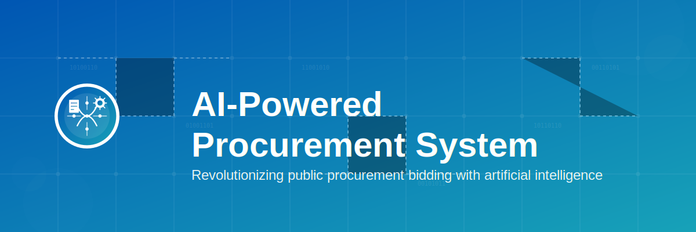
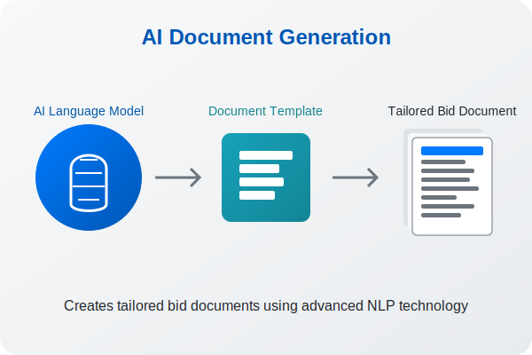
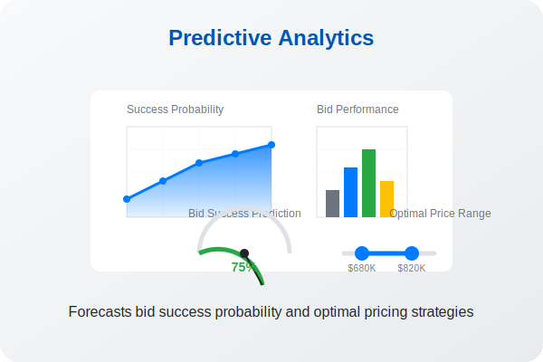
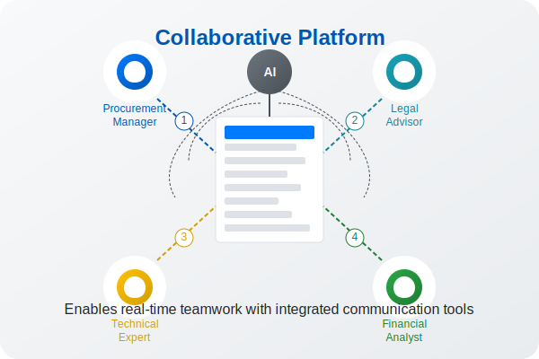

# AI-Powered Procurement System (AIPS)



## Project Overview

The AI-Powered Procurement System (AIPS) is an innovative platform designed to revolutionize the public procurement bidding process through artificial intelligence and automation technologies. This system collects and analyzes data from various sources to support bid strategy development and successful document preparation.

### Key Features

- **Data Collection & Analysis**: Gathers procurement-related data from various sources including SAM.gov
- **Success Probability Prediction**: Uses past bidding data and market trends to predict success rates
- **AI-Powered Document Generation**: Automatically creates tailored bidding documents
- **User-Centered Interface**: Provides an intuitive experience for users
- **Blockchain-Based Security**: Ensures data integrity and security
- **Collaboration Tools**: Supports team-based proposal development

## System Architecture


The system consists of the following key modules:

1. **Data Collection Module** - Gathers and processes data from multiple sources
2. **AI Analysis Module** - Analyzes collected data and builds predictive models
3. **Automation & Optimization Solutions** - Generates bid documents and optimizes processes
4. **User Interface** - Allows users to interact with the platform
5. **Monitoring & Management** - Tracks system status and performance
6. **Security Module** - Manages data and system security

## Technical Implementation

### AI-Based Document Generation

The system employs advanced Natural Language Processing (NLP) techniques to automatically generate customized bidding documents:



- Uses BERT models to analyze RFP requirements
- Creates tailored documents based on company profile and strengths
- Supports multiple languages and document formats

### Predictive Analytics



- Employs ensemble machine learning models including Random Forest, XGBoost, and deep learning
- Predicts bid success probability based on historical data
- Recommends optimal pricing strategies
- Analyzes competitive landscape

### Blockchain-Based Data Management

- Utilizes Hyperledger Fabric for secure, immutable record-keeping
- Implements smart contracts for automated bid submission and evaluation
- Ensures compliance with regulatory requirements
- Provides audit trails for all activities

### Real-Time Collaboration



- Cloud-based document co-editing capabilities
- AI chatbot for 24/7 bidding assistance
- Task management and notification systems
- Integrated communication tools

## Technological Innovation

The system addresses several technical challenges through innovative approaches:

- **Flexibility vs. Standardization**: Uses modular architecture and AI-based dynamic rule engines
- **Security vs. Accessibility**: Combines blockchain with zero-knowledge proof technologies
- **Complexity vs. Usability**: Implements AI-based personalized user interfaces
- **Real-time vs. Accuracy**: Employs edge computing and distributed processing
- **Automation vs. Human Judgment**: Utilizes explainable AI (XAI) for transparent decision-making

## Business Impact

The AI-Powered Procurement System delivers significant benefits:

- **40% Time Saved** in bid preparation
- **35% Success Rate Improvement** for winning contracts
- **60% Reduction** in compliance issues
- **30% Cost Savings** in the bidding process

## Getting Started

### Prerequisites

- Node.js 14.x or higher
- MongoDB 4.x or higher
- Recent web browser (Chrome, Firefox, Edge)

### Installation

```bash
# Clone the repository
git clone https://github.com/JJshome/ai-procurement-system.git

# Navigate to the project directory
cd ai-procurement-system

# Install dependencies
npm install

# Configure environment variables
cp .env.example .env
# Edit .env with your configuration

# Start the development server
npm run dev
```

### Demo

A live demo of the application is available at the following URL:
[AIPS Demo](https://aips-demo.example.com)

Use the following credentials to access the demo:
- Username: `demo@example.com`
- Password: `AIprocurement2025`

## Project Structure

```
ai-procurement-system/
├── public/                 # Static assets
│   ├── css/                # Stylesheets
│   ├── img/                # Images
│   ├── js/                 # Client-side JavaScript
│   └── index.html          # Main HTML file
├── server/                 # Backend code
│   ├── api/                # API endpoints
│   ├── models/             # Database models
│   ├── services/           # Business logic
│   └── index.js            # Server entry point
├── ai-modules/             # AI functionality
│   ├── document-generator/ # Document generation logic
│   ├── prediction-engine/  # Prediction algorithms
│   └── nlp-processor/      # Natural language processing
├── blockchain/             # Blockchain implementation
├── tests/                  # Test suite
├── package.json            # Project dependencies
└── README.md               # Project documentation
```

## Future Development

- Integration with additional procurement platforms beyond SAM.gov
- Enhanced AI capabilities using more sophisticated language models
- Mobile application development
- Advanced analytics dashboard for bid performance tracking
- API for third-party integrations

## License

This project is licensed under the MIT License - see the [LICENSE](LICENSE) file for details.

## Acknowledgements

- Department of Homeland Security for project inspiration
- SAP Ariba, Oracle, and Coupa Software for procurement software best practices
- IBM, GEP Smart, and JAGGAER for AI and automation technology insights

---

© 2025 TechInnovate Solutions. All rights reserved.
