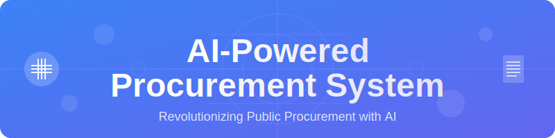
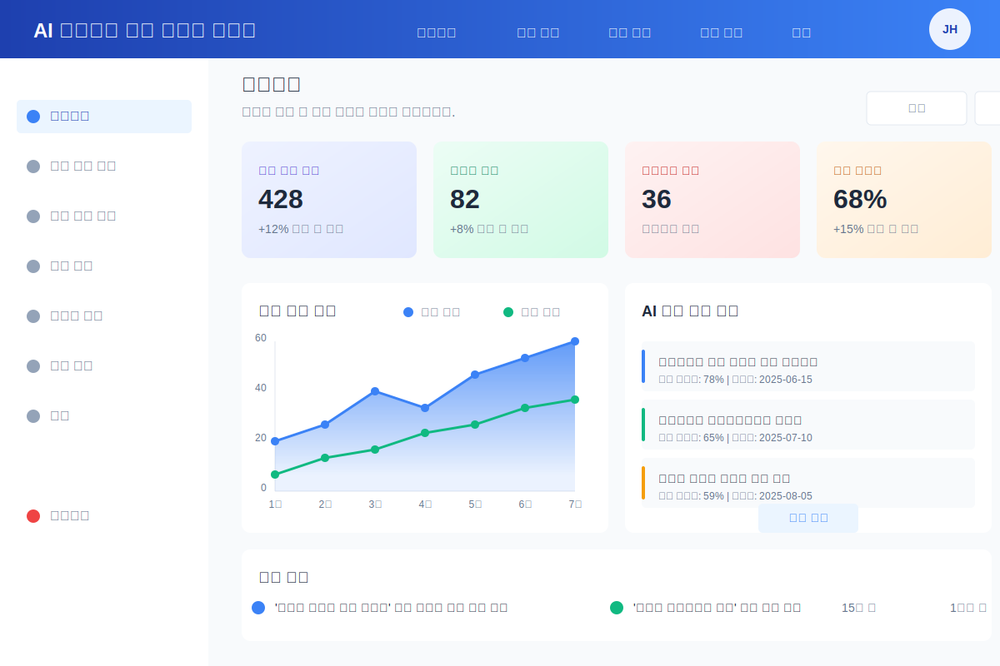
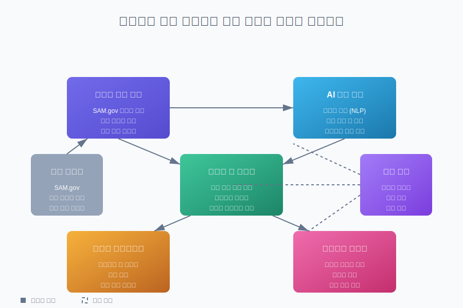
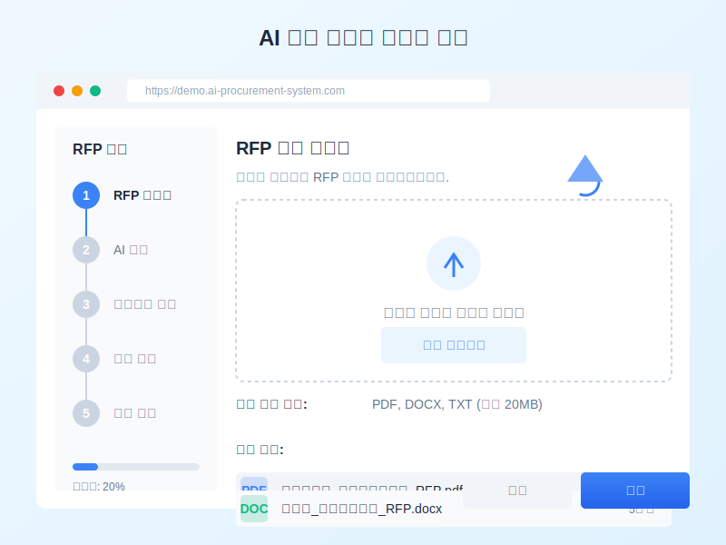

# 인공지능 기반 공공조달 입찰 최적화 시스템 (AI-Powered Procurement System)

<div align="center">
  
  
  <p align="center">
    <b>혁신적인 AI 기술로 공공조달 프로세스를 최적화하는 지능형 플랫폼</b>
  </p>
  
  <p align="center">
    <a href="#주요-기능">주요 기능</a> •
    <a href="#시스템-아키텍처">시스템 아키텍처</a> •
    <a href="#기술-스택">기술 스택</a> •
    <a href="#설치-방법">설치 방법</a>
  </p>
  
  <p align="center">
    
    
    
  </p>
</div>

## 📋 프로젝트 개요

이 시스템은 인공지능(AI) 기술을 활용하여 공공조달 입찰 프로세스를 최적화하고 자동화하는 혁신적인 플랫폼입니다. 다양한 데이터 소스에서 정보를 수집하고 분석하여 입찰 전략 수립과 성공적인 문서 작성을 지원합니다. 블록체인 기술을 통해 데이터의 무결성을 보장하고, 사용자 친화적인 인터페이스로 복잡한 입찰 과정을 단순화합니다. 본 시스템은 (주)유케어트론의 출원된 특허에 기반하고 있습니다. **(해당 내용은 모두 가상적임을 이해하기 바랍니다)**

<div align="center">
  
</div>

## ✨ 주요 기능

### 🔍 데이터 수집 및 분석
- SAM.gov와 같은 다양한 공공조달 플랫폼에서 실시간 데이터 수집
- 빅데이터 분석을 통한 시장 동향 및 경쟁 정보 파악
- 과거 입찰 데이터를 통한 성공 패턴 식별

### 🤖 AI 기반 문서 자동화
- NLP 기술을 활용한 RFP(Request for Proposal) 문서 자동 분석
- 맞춤형 입찰 제안서 자동 생성
- 다국어 지원 및 현지화 기능

### 📊 예측 분석 및 의사결정 지원
- 머신러닝 모델을 활용한 낙찰 확률 예측
- 최적 입찰가 추천 및 경쟁 전략 제안
- 시각화 도구를 통한 직관적인 데이터 해석

### 🔗 블록체인 기술 적용
- 입찰 과정의 투명성 및 무결성 보장
- 스마트 계약을 통한 자동화된 프로세스
- 안전한 데이터 관리 및 접근 제어

### 👥 협업 도구
- 실시간 문서 공동 편집 기능
- 팀 간 효율적인 커뮤니케이션 지원
- AI 챗봇을 통한 24/7 지원 서비스

## 🏗️ 시스템 아키텍처

이 시스템은 다음과 같은 주요 모듈로 구성되어 있습니다:

<div align="center">
  
</div>

1. **데이터 수집 모듈** - 다양한 소스에서 데이터를 수집하고 전처리합니다.
2. **AI 분석 모듈** - 수집된 데이터를 분석하고 예측 모델을 구축합니다.
3. **자동화 및 최적화 솔루션** - 입찰 문서 생성 및 프로세스 최적화를 수행합니다.
4. **사용자 인터페이스** - 직관적인 대시보드와 시각화 도구를 제공합니다.
5. **블록체인 레이어** - 데이터의 무결성과 투명성을 보장합니다.
6. **보안 모듈** - 데이터 암호화 및 접근 제어를 관리합니다.

## 🛠️ 기술 스택

### 프론트엔드
- React.js
- Redux
- Material-UI
- D3.js (데이터 시각화)

### 백엔드
- Node.js
- Express
- GraphQL
- MongoDB (메타데이터 저장)
- Redis (캐싱)

### AI 및 머신러닝
- TensorFlow/PyTorch
- OpenAI API
- BERT (자연어 처리)
- XGBoost (예측 모델링)

### 블록체인
- Hyperledger Fabric
- 스마트 계약 (Solidity)

### 클라우드 및 배포
- Docker
- Kubernetes
- AWS/Azure

## 🚀 설치 방법

### 사전 요구사항
- Node.js 16.x 이상
- MongoDB
- Redis
- Docker & Docker Compose

### 로컬 개발 환경 설정

```bash
# 저장소 클론
git clone https://github.com/JJshome/ai-procurement-system.git
cd ai-procurement-system

# 의존성 설치
npm install

# 환경 변수 설정
cp .env.example .env
# .env 파일을 편집하여 필요한 API 키와 설정 추가

# 개발 서버 실행
npm run dev
```

### Docker를 이용한 배포

```bash
# Docker 이미지 빌드
docker-compose build

# 컨테이너 실행
docker-compose up -d
```

<div align="center">
  
</div>

## 시뮬레이션 환경 기능

1. **RFP 문서 업로드**
   - 사용자가 RFP 문서를 업로드하면 시스템이 이를 자동으로 처리
   - 다양한 형식(PDF, DOCX, TXT)의 파일 지원
   - 드래그 앤 드롭 인터페이스 제공

2. **AI 분석 과정**
   - 문서 텍스트 추출 → 자연어 처리 분석 → 요구사항 식별 → 메타데이터 추출 → 분류 및 우선순위 지정 → 요약 및 결과 생성
   - 각 단계별 진행 상황을 시각적으로 표시
   - 실시간 분석 결과 미리보기 제공

3. **요구사항 검토 및 문서 생성**
   - 분석된 요구사항을 사용자가 검토하고 필요시 수정 가능
   - 자동 생성된 입찰 문서에는 회사 소개, 제안 개요, 기술 접근법, 프로젝트 일정, 비용 제안 등의 섹션 포함